# Diagramme de Cas d'Utilisation - LegalAI Pro

## Vue d'ensemble
Ce diagramme présente les différents cas d'utilisation de la plateforme LegalAI Pro pour les auto-entrepreneurs et les administrateurs.

```mermaid
graph TB
    %% Acteurs
    AE[👤 Auto-entrepreneur]
    ADMIN[🛡️ Administrateur]
    IA[🤖 Assistant IA]
    SYS[⚙️ Système]

    %% Cas d'utilisation - Authentification
    subgraph AUTH["🔐 Authentification"]
        UC1[Se connecter]
        UC2[Créer un compte]
        UC3[Réinitialiser mot de passe]
        UC4[Gérer profil]
    end

    %% Cas d'utilisation - Assistant IA
    subgraph AI["🤖 Assistant IA Juridique"]
        UC5[Poser question juridique]
        UC6[Obtenir conseil personnalisé]
        UC7[Rechercher dans base légale]
        UC8[Analyser situation juridique]
    end

    %% Cas d'utilisation - Documents
    subgraph DOC["📄 Gestion Documents"]
        UC9[Générer contrat]
        UC10[Créer facture]
        UC11[Rédiger CGV]
        UC12[Télécharger document]
        UC13[Modifier template]
        UC14[Archiver document]
    end

    %% Cas d'utilisation - Conformité
    subgraph COMP["✅ Suivi Conformité"]
        UC15[Consulter échéances]
        UC16[Recevoir rappels]
        UC17[Vérifier obligations]
        UC18[Planifier déclarations]
        UC19[Suivre statut conformité]
    end

    %% Cas d'utilisation - Administration
    subgraph ADMIN_UC["🛡️ Administration"]
        UC20[Gérer utilisateurs]
        UC21[Consulter analytics]
        UC22[Modérer contenu]
        UC23[Configurer IA]
        UC24[Gérer abonnements]
        UC25[Support technique]
    end

    %% Cas d'utilisation - Système
    subgraph SYS_UC["⚙️ Système"]
        UC26[Traiter paiements]
        UC27[Envoyer notifications]
        UC28[Sauvegarder données]
        UC29[Mettre à jour base légale]
        UC30[Générer rapports]
    end

    %% Relations Auto-entrepreneur
    AE --> UC1
    AE --> UC2
    AE --> UC3
    AE --> UC4
    AE --> UC5
    AE --> UC6
    AE --> UC7
    AE --> UC8
    AE --> UC9
    AE --> UC10
    AE --> UC11
    AE --> UC12
    AE --> UC14
    AE --> UC15
    AE --> UC16
    AE --> UC17
    AE --> UC18
    AE --> UC19

    %% Relations Administrateur
    ADMIN --> UC1
    ADMIN --> UC4
    ADMIN --> UC20
    ADMIN --> UC21
    ADMIN --> UC22
    ADMIN --> UC23
    ADMIN --> UC24
    ADMIN --> UC25
    ADMIN --> UC13

    %% Relations IA
    IA --> UC5
    IA --> UC6
    IA --> UC7
    IA --> UC8
    IA --> UC9
    IA --> UC10
    IA --> UC11

    %% Relations Système
    SYS --> UC26
    SYS --> UC27
    SYS --> UC28
    SYS --> UC29
    SYS --> UC30
    SYS --> UC16

    %% Extensions et inclusions
    UC5 -.->|extends| UC8
    UC9 -.->|includes| UC5
    UC10 -.->|includes| UC5
    UC11 -.->|includes| UC5
    UC15 -.->|includes| UC27
    UC16 -.->|includes| UC27
    UC20 -.->|includes| UC21
    UC24 -.->|includes| UC26

    %% Styles
    classDef actor fill:#e1f5fe,stroke:#01579b,stroke-width:2px
    classDef usecase fill:#f3e5f5,stroke:#4a148c,stroke-width:1px
    classDef system fill:#fff3e0,stroke:#e65100,stroke-width:1px

    class AE,ADMIN,IA,SYS actor
    class UC1,UC2,UC3,UC4,UC5,UC6,UC7,UC8,UC9,UC10,UC11,UC12,UC13,UC14,UC15,UC16,UC17,UC18,UC19,UC20,UC21,UC22,UC23,UC24,UC25 usecase
    class UC26,UC27,UC28,UC29,UC30 system
```

## Description des Cas d'Utilisation

### 🔐 Authentification
- **UC1 - Se connecter** : L'utilisateur s'authentifie sur la plateforme
- **UC2 - Créer un compte** : Inscription d'un nouvel auto-entrepreneur
- **UC3 - Réinitialiser mot de passe** : Récupération d'accès en cas d'oubli
- **UC4 - Gérer profil** : Modification des informations personnelles

### 🤖 Assistant IA Juridique
- **UC5 - Poser question juridique** : Interaction avec l'IA pour obtenir des conseils
- **UC6 - Obtenir conseil personnalisé** : Réponses adaptées au profil utilisateur
- **UC7 - Rechercher dans base légale** : Consultation de la documentation juridique
- **UC8 - Analyser situation juridique** : Évaluation complète d'un cas

### 📄 Gestion Documents
- **UC9 - Générer contrat** : Création automatique de contrats personnalisés
- **UC10 - Créer facture** : Génération de factures conformes
- **UC11 - Rédiger CGV** : Création de conditions générales de vente
- **UC12 - Télécharger document** : Export des documents générés
- **UC13 - Modifier template** : Personnalisation des modèles (admin)
- **UC14 - Archiver document** : Sauvegarde et organisation

### ✅ Suivi Conformité
- **UC15 - Consulter échéances** : Visualisation du calendrier des obligations
- **UC16 - Recevoir rappels** : Notifications automatiques
- **UC17 - Vérifier obligations** : Contrôle du respect des règles
- **UC18 - Planifier déclarations** : Organisation des démarches administratives
- **UC19 - Suivre statut conformité** : Tableau de bord de conformité

### 🛡️ Administration
- **UC20 - Gérer utilisateurs** : Administration des comptes clients
- **UC21 - Consulter analytics** : Analyse des métriques de la plateforme
- **UC22 - Modérer contenu** : Contrôle de la qualité du contenu
- **UC23 - Configurer IA** : Paramétrage de l'assistant intelligent
- **UC24 - Gérer abonnements** : Administration des plans tarifaires
- **UC25 - Support technique** : Assistance aux utilisateurs

### ⚙️ Système
- **UC26 - Traiter paiements** : Gestion des transactions financières
- **UC27 - Envoyer notifications** : Système de messagerie automatique
- **UC28 - Sauvegarder données** : Backup et sécurité des données
- **UC29 - Mettre à jour base légale** : Actualisation de la réglementation
- **UC30 - Générer rapports** : Production de statistiques et analyses

## Relations
- **Extends** : Un cas d'utilisation étend un autre (fonctionnalité optionnelle)
- **Includes** : Un cas d'utilisation inclut obligatoirement un autre
- **Association** : Lien direct entre acteur et cas d'utilisation